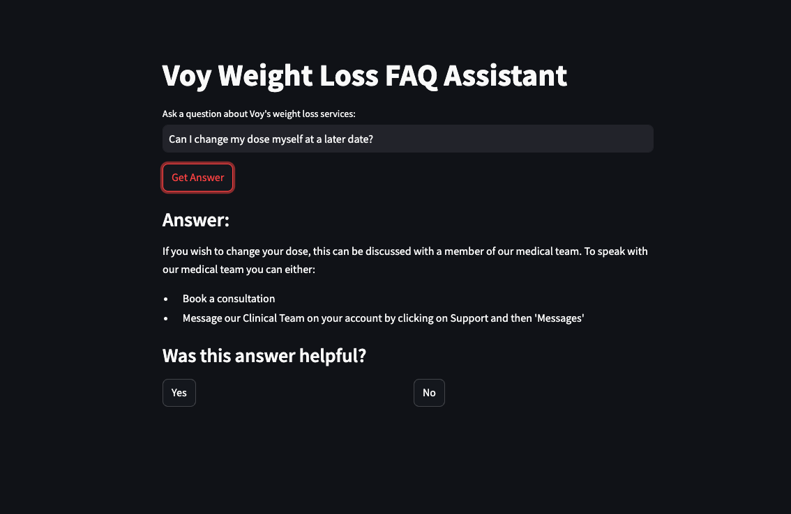
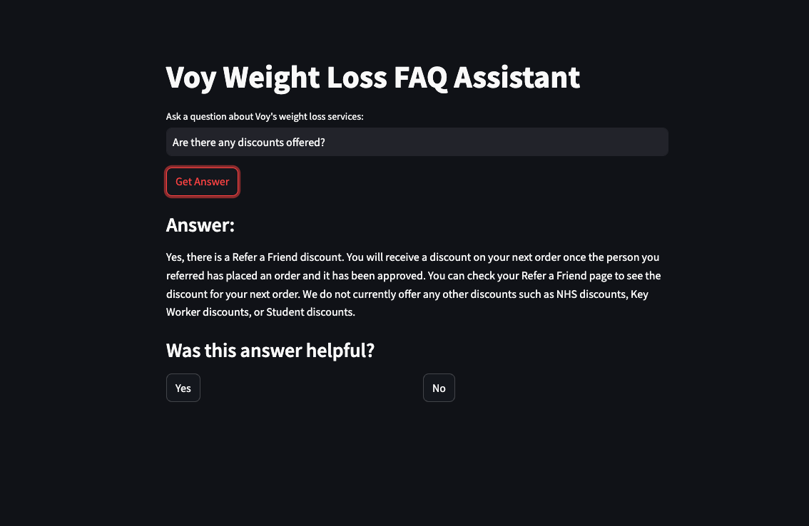
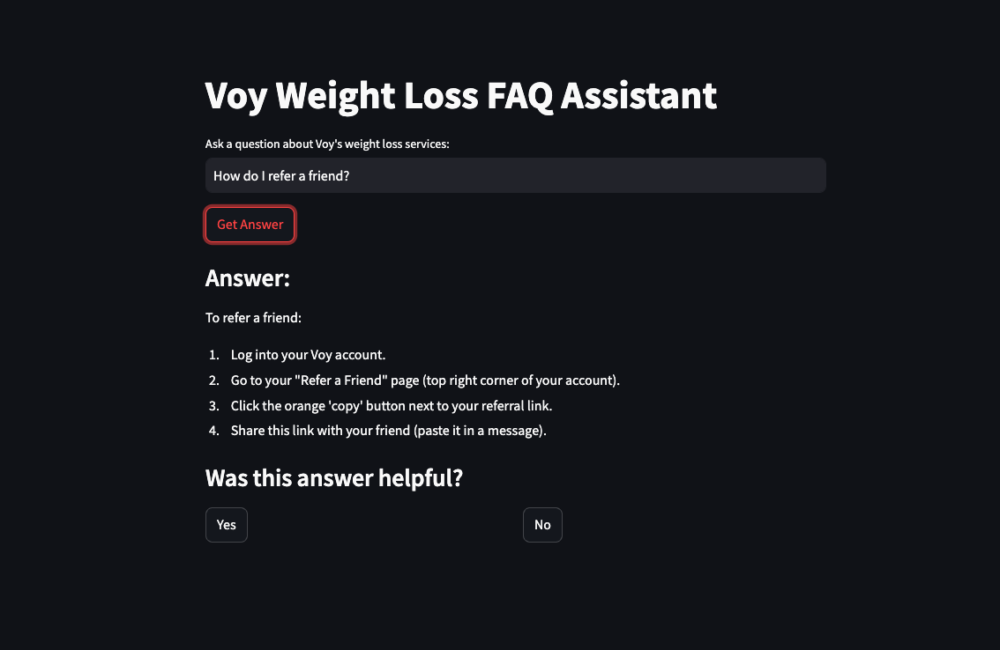

# QA System for Telehealth services 

## Setting up the environment
1. Use `pyenv` or any other tool to first setup a virtual environment, for python 3.10.3 (which is the version used here)
2. Use the `requirements.txt` install the necessary packages in the environment
3. This is a development environment so lacks any tooling for testing or deployment
   
## Web scraping of FAQ Pages
To run the web scraping task, you need to run the file `utils/url_scraper.py`. It is self contained but needs the right enviornment to have been setup a-priori. I have already run and saved the output to `outputs/parsed_urls.txt`, so this need not be run again.

It works as follows:
1. Global Variables: The script defines several global variables, including main_queue, parsed_links_queue, parsed_links, session, f_out, and visited_urls.
2. `get_url Function`: This is an asynchronous function that takes a URL as input, sends a GET request to the URL using `aiohttp`, and returns the response text. 
3. `worker Function`: This is an asynchronous function that runs indefinitely. It uses `selenium` to load a webpage, parses the HTML using `BeautifulSoup`, and extracts links that start with specific urls. The extracted links are then added to the `parsed_links_queue`.
4. `consumer Function`: This function also runs asynchronously. It consumes URLs from the `parsed_links_queue`, checks if the URL has already been parsed, and if not, adds it to the parsed_links variable and writes it to a file.
5. `main` : The main function is the entry point of the script. It initializes the session and file handle for saving the urls, sets up the seed URL, and starts the worker and consumer functions.

## QA system and Streamlit app
To run the QA system, you can do so via the streamlit app in `app.py`. It is self contained but needs the right enviornment to have been setup a-priori.
You can find screenshots of some of the runs at the end of this document

`$ streamlit run app.py`

## Evaluation of the QA system
* The evaluation of the QA system is done using the `eval.ipynb` notebook.  
* The notebook assesses:
    * the quality of the retriever, 
    * the similarity between generated responses and the ideal answers for several questions, as well as 
    * the responses on 3 criteria for medical fact checking, safe advice and completeness.

## Logging
* The logging of prompts and responses is done using the `utils/logging.py` module. 
* It uses callbacks to log the prompts and responses during the LLM call. 
* The output is saved in `outputs/llm_outputs.json`, which can be used for manual evaluation.

## Project Design
### RAG: The file `utils/rag.py` contains the code for RAG.
* Embeddings and Vector Store:
    * For the vector store, I used the `InMemoryVectorStore` from Langchain. This is a simple in-memory store for vectors, which is useful for small datasets.
    * For the embeddings I used the `HuggingFaceEmbeddings` from Langchain. This is a pre-trained model from HuggingFace that can be used to generate embeddings for text.
    * I split the documents into chuks with some overlap before storing them in the vector store, with appropriate metadata.
    * Since the vectorstore was small in size, the code provides an option to save the vectorstore to a file locally, to be reloaded when needed.
* Retriever:
    * I have used the InMemoryVectorStore as retriever. 
    * The search function used in the code is `mmr` or `Maximal Marginal Relevance`, which selects examples based on a combination of which examples are most similar to the inputs, while also optimizing for diversity
    * During evaluation of the retriever, I have used `Mean Reciprocal Rank (MRR)`, `precison@k` and `recall@k` as metrics to measure the quality of the retriever.

### Question and Answer generation: The file `qa_system.py` contains the code for the QA system
* Framework: I have used `LangChain` with Google's latest `Gemini 2.0 Pro (experimental)` model. The model can be swapped for any other model from LangChain.
* Answer generation:
    * The code implements a small LCEL chain that pipes the context retrieval, prompt creation and querying of the LLM.
    * The `temperature` of the LLM is set to 0.2, to reduce creativity and thereby avoid hallucinations
    * The prompt is designed to enforce that the LLM only answers questions based on the context
    * The prompt is created using the PromptTemplate class from LangChain, and the context and user question is populated once the chain is run.
    * The output is then passed through `StructuredOutputParser` to extract the answer

### The QA system app works as follows:

1. The user inputs a question on the web browser where the streamlit app is running
2. The app then calls internally the function `answer_question` of the QASystem class. This function runs the above LLM chain and gets an answer
3. The result/answer is sent back to the user and displayed on the browser.
4. The app can accept feedback, which is not being used currently, but clicking on either "yes" or "no" refershes the page, ready for the next question.

## Limitations:
* Currently the app is a one-shot QA system, which doesn't support follow-up questions in the same run.
* The streamlit app is quite basic with a lot of latency, this was built for demo purposes only.
* The test dataset is quite limited, but can be extended to cover more questions and edge cases

## Improvements
* The seed urls and several file paths are hardcoded in the script. This can be changed to be loaded from a config file and making the script more configurable
* Similarly, any hardcoded prompts can also be stored in a prompts library, and loaded from there
* Better logging mechanism can be added to the logging module, as well as tracking the system runs for evaluation 
* The LLM and embedding models can be made configurable so that different ones can be used based
* Additional corpus of internal documents about the company can be included to improve the quality of the retriever as well as extend the scope of the QA system
* We can use a vector database to store the embeddings instead of an in memory one. This was chosen only because the dataset is small

## Screenshots of the app

